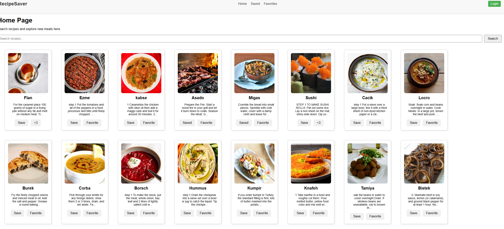
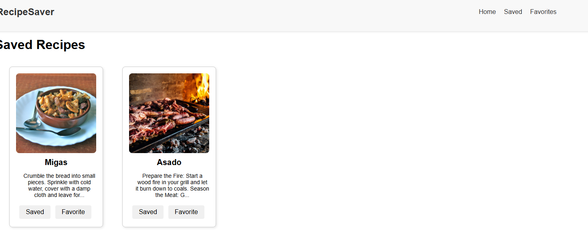
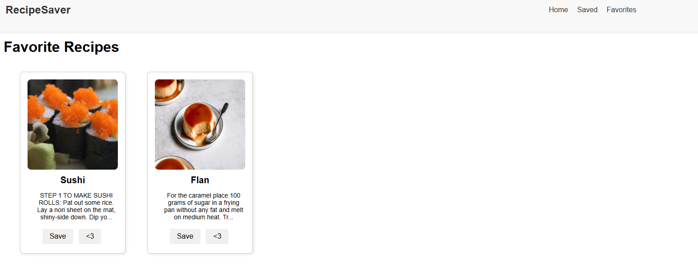
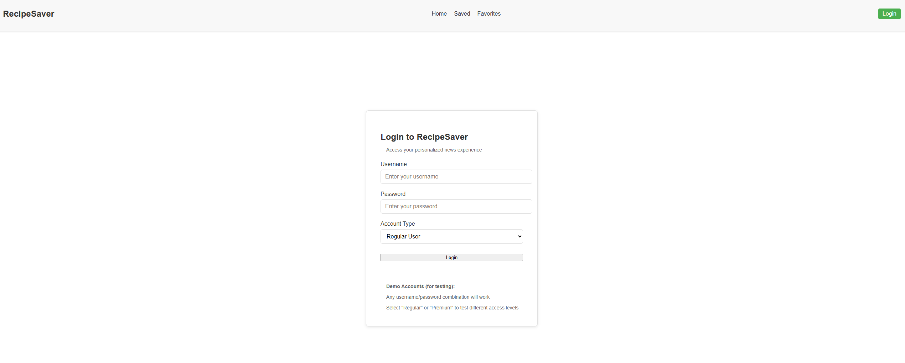

# RecipeSaver

## Description
This is a website that allows users to look for recipes and save/favorite them for anyones they would like to make. The purpose of this is to solve a problem of finding recipes all other the internet. This can be one centralized place for all recipes so that users can only need to look in one place. 

## Technologies used
- MealDB https://www.themealdb.com/api.php
- ChatGPT
  - for some help with .css and test files mainly coming up with style elments and specific test cases to test the app
- React: the component ui structure for this project
- React Router Dom: handles the client side routing/navigation for all the webpages
- React Context API: managging the application authentatication, saved, and favorited recipes states
- CSS: used for stylign the webpage
- Vite: backbopne of the project, what everything is run through.
- VITest: testing framework used for the tests
- Local Storage/SessionStorage: storages storing user data locally or on a session basis

## Setup for Develpment
- Clone repo here: https://github.com/Reagansierra1/RecipeSaver/tree/main
- run npm install to install depednecies locally
- run code . to ahve project up in VS Code
- Deploy website to the internet and simply serach around
- Register an account (make sure it is a valid account)
- access the save and faovrites pages and save/favorites buttons

## Rooutes Avialble
- / (HomePage)
- /saved (SavedPage)
- /favorites (FavoritesPage)
- /login (LoginPage)
- /register (RegisterPage)

### Homepage
This is the page where all recipes available are listed. As of now, users can savea and favorite these recipes to be saved later. Features to be added later

### Saved Page
This is the page where all saved recipes will be shown. Features to be added:

### Favorites Page
This is the page where all favorited recipes will be shown. Features to be added:

### Login Page
This is the page where users can log in or create an account. Features to be added:

### Register Page
This is the page where users can register an account. Features to be added:

## APIs Used
- MealDB https://www.themealdb.com/api.php

## Authentication
- USed JWT and CSRF token for security benefits
- Have proper token deletion once session or user logs out
- Santize user inputs are used to make sure maliciiious code is not passed in and potentially executed
  - used in:
    - search
    - login
    - register
- User are to make an account through registration that follows character guidlines:
  - Username must be at least 8 characters
  - passwords cannot exceed 30 characters
- Users are then to log in in the /login page to use the favorites and save functions
  - username and passwords are distinctly checked to make sure they are exact matches

## Testing
As of right now, tests are not passing. Once user specific data was introduced, replicating tests became to complex too implement and thusu resulting in tons of time to try to get the existing tests even passing. Tests will need refactoring when this project is picked again. To run these tests, make all requirements are met in the Setup section and then simply run npm run test.

## Deployment Steps
- Make sure the github is linked to the account vercel is using
- make sure you are deploying Vite application
- set build command to npm run build
- output dir is dist
- isntall command is npm install
- if there are any environemnt variables, either import your .env file or set the api key to its value exactly.
  - this proect has not api keys.

## Future Work
Allow for users to upload their own recipes to be accessed by anyone. Make sure testing suite is working propely again.

## Images of Recipe Saver

## Deployment URL
- https://recipe-saver-jm9s.vercel.app